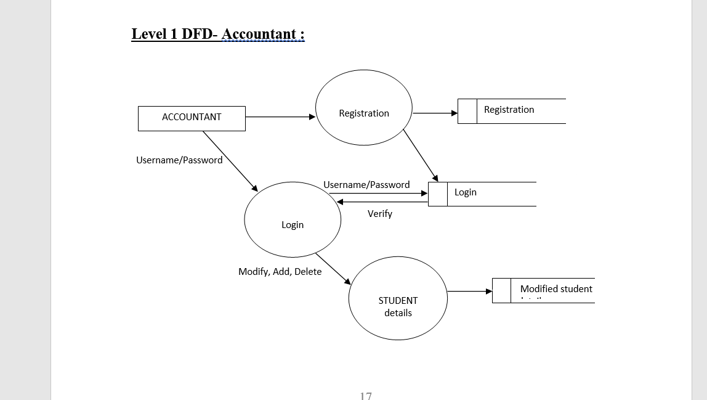

# FEE_REPORT
Objective/ Vision -
A fee report software where admin can add/view/delete accountant and accountant can add/view/edit/delete student, check due fee and logout.

Inroduction -
Fees Collection and Management are critical operations for the schools,colleges and institutions . Iolite helps in managing the operation of fees collection and fee receipt generation easily and quickly. Also its automates the fee receipts entries in the school accounts eliminating the need of repeated data entries.

Project Description -
A FEE Report  System work as a desktop application the aim to make this system for reducing the work load, containing secure database and contain all the functionality which used in School.  Application contain fees relevant module, exam relevant module and also handle student information, which reduce the paper work. System contains various functionality like reports.  The System has different users like Power User, User, Admin Depending on user, it has assigned access rights. Only admin has right to access the full system.  The system provides user friendly environment so user interact with system easily.

Users of the System-
Admin
Accountant
Functional Requirements
1. Admin-   

Can add/view/edit/delete accountant,

Can logout

2. Accountant--
Can add/view/edit/delete students,

Can check due fee,

Can logout

Project Scope-
 Today in this competitive world every work has been become computerized. The manual way of working has become very hectic, time consuming as well as very difficult. So when I got opportunity to make the system of “FEE REPORT” Computerized I made use of it.
 According Schools, all task done manually weather adding students information, teacher information, fees structure any relevant information. Manually added by one or more people, this make burden for saving information. 
 With the existing scenario the work become very time consuming and needed more people and facing several problems during work. 
 In existing system fees collection mechanism is very difficult to collect each student fees and generate report manually.

Front End and Back End

Front End: Java Swing

Back End: MySQL

How project works?

To get detail explanation about project, download the document file. It includes snapshots with explanation.

Some screenshots are given below:
1)FEE REPORT- THIS IS THE FIRST PAGE FROM WHERE PROJECT STARTS 

2)ADMIN LOGIN- THIS PAGE IS OPENED AFTER CLICKING ON ADMIN LOGIN BUTTON
(use admin name as- admin & password as-admin12345)

3)ADIMIN SECTION -THIS PAGE IS OPENED AFTER LOGIN OF ADMIN
--here three buttons are shown 

4)ADD ACCOUNTANAT - AFTER CLICKING ON ADD ACCOUNTANT YOU WILL GET THIS AND THUS ADD THE ACCOUNTANAT

you will get below img by adding successfull the accountant.Then press OK.

5)VIEW ACCOUNTANT-ON CLICKING VIEW YOU GET THIS 

Now after exit and then logout you see FEE-REPORT page again,then click on accountant login
NOW Login through ACCOUNTANT .

6)ACCOUNTNT LOGIN - LOGING THROUGH THE ACCOUNTANT NAME AND PASSWORD,and click login.

7)ACCONTANT SECTION-HERE YOU SEE FIVE BUTTONS .

8)ADD STUDENT -THE DETAILS YOU HAVE TO PUT TO ADD STUDENT .

9)VIEW STUDENT - YOU WILL SEE THE REGISTERED STUDENTS .

10)EDIT - YOU CAN ALSO MODIF THE STUDENT DETAILS 

11)DUE FEES - THROUGH YOU CAN SEE THE STUDENTS HAVING DUE FEES 

AFTER LOGOUT YOU WILL COME TO THE MAIN "FEES _REPORT" PAGE
.....

3.1 Software and Hardware Specifications
3.1.1 Hardware Specification
	Processor  		  : 	Pentium III/AMD Athlone XP
	RAM	       		  : 	128 MB
	Hard disk    		  : 	20 GB
	FDD             		  : 	1.44MB
	Monitor      		  : 	14 inch
	Mouse        		  : 	3 Button scroll
	CD Drive     		  : 	52 X
           Keyboard   		  : 	108 keys
3.1.2 Software Specification
	Operating System   	 : 	Windows 2016/xp /7
	Languages  		 : 	java (SWING ,JDBC)
	Front End	   	 : 	SWING 
           Platform		 : 	NETBEANS
           Web Servers		 : 	localhost
	Backend                    : 	MYSQL
	Browser Program       :        Internet explorer/Mozilla Fireworks

4.1 Software development life-cycle(SDLC) :

The systems development life cycle (SDLC), or software development process in systems engineering, information systems and software engineering, is a process of creating or altering information systems, and the models and methodologies that people use to develop these systems. In software engineering, the SDLC concept underpins many kinds of software development methodologies. These methodologies form the framework for planning and controlling the creation of an information system: the software development process.

		 

A Systems Development Life Cycle (SDLC) adheres to important phases that are essential for developers, such as planning, analysis, design, and implementation, and are explained in the section below.It include evaluation of present system, information gathering, feasibility study and request approval. A number of system development life cycle (SDLC) models have been created: waterfall, fountain, spiral, build and fix, rapid prototyping, incremental, and synchronize and stabilize. The oldest of these, and the best known, is the waterfall model: a sequence of stages in which the output of each stage becomes the input for the next. These stages can be characterized and divided up in different ways, including the following:

•	Systems analysis, requirements definition: Defines project goals into defined functions and operation of the intended application. Analyzes end-user information needs.
•	Systems design: Describes desired features and operations in detail, including screen layouts, business rules, process diagrams, pseudocode and other documentation.
•	Development: The real code is written here.
•	Integration and testing: Brings all the pieces together into a special testing environment, then checks for errors, bugs and interoperability.
•	Acceptance, installation, deployment: The final stage of initial development, where the software is put into production and runs actual business.
•	Maintenance: What happens during the rest of the software's life: changes, correction, additions, moves to a different computing platform and more. This is often the longest of the stages.

Data Flow Diagram:
A data flow diagram (DFD) is a graphical representation of the "flow" of data through an information system, modeling its process aspects. Often they are a preliminary step used to create an overview of the system which can later be elaborated. DFDs can also be used for the visualization of data processing (structured design).
A DFD shows what kinds of information will be input to and output from the system, where the data will come from and go to, and where the data will be stored. It does not show information about the timing of processes, or information about whether processes will operate in sequence or in parallel (which is shown on a flowchart).the basic notation used to create a DFD’s are as follows:
1. Dataflow:   data moves in a specific from an origin to a destination.
                      
 
	
2. Process:  People ,procedures or device that use or produce data. The physical components not identified.
                                           
                                             
 3. Source:  external sorce or destination of data, which may be people programs, organizations or other entities.

                      
 4 .Data source:  here data are store and referenced by a process in the system.

                                                                                                    
                                             

For  The Admin:

 

For the Accountant :

 

Level 1 DFD- Administrator

                  
 
Level 1 DFD- Accountant :
  

